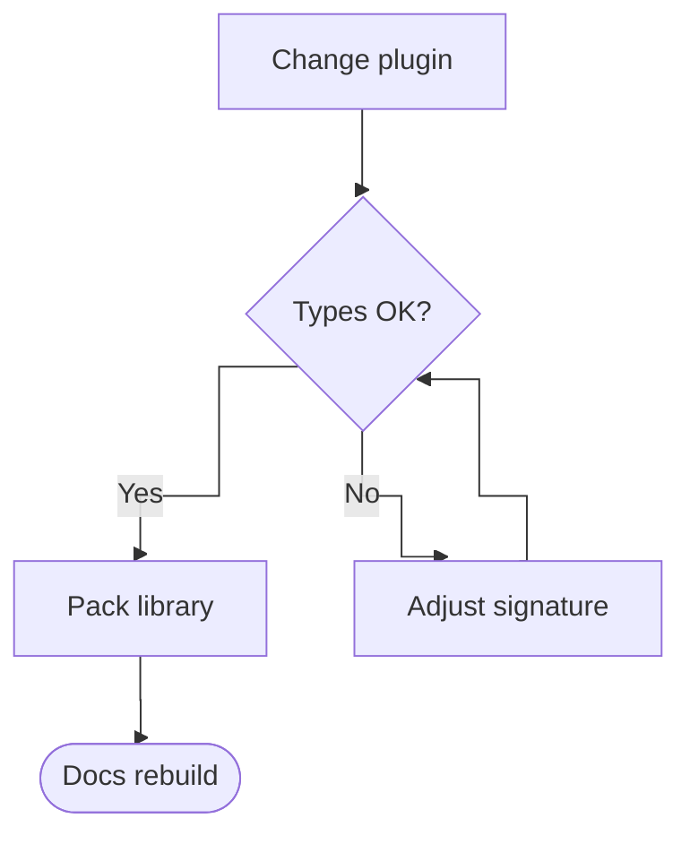
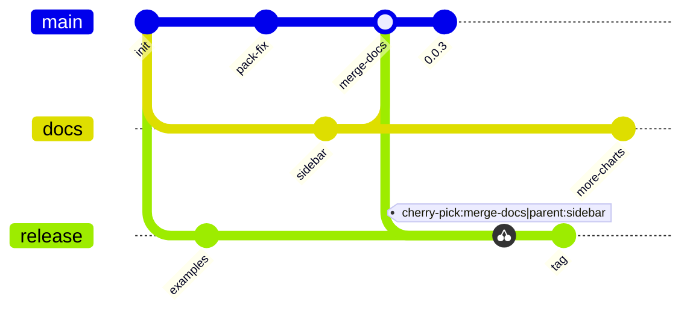
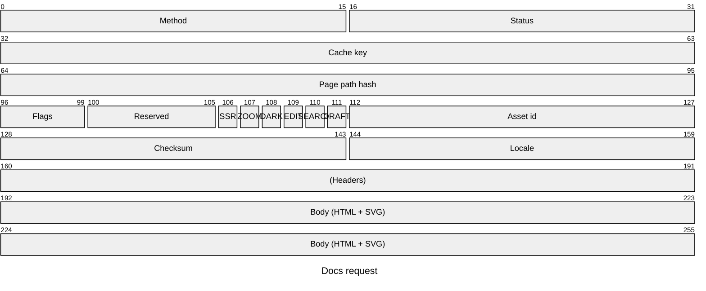
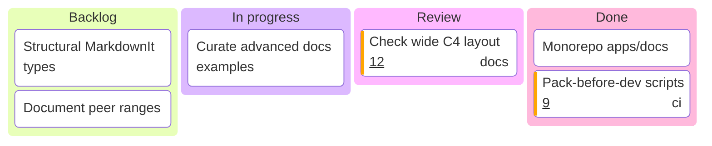
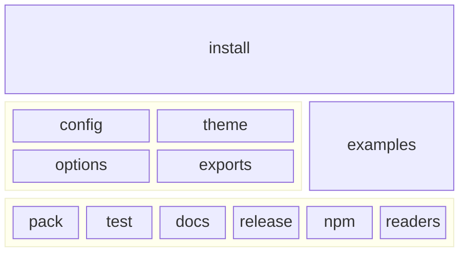
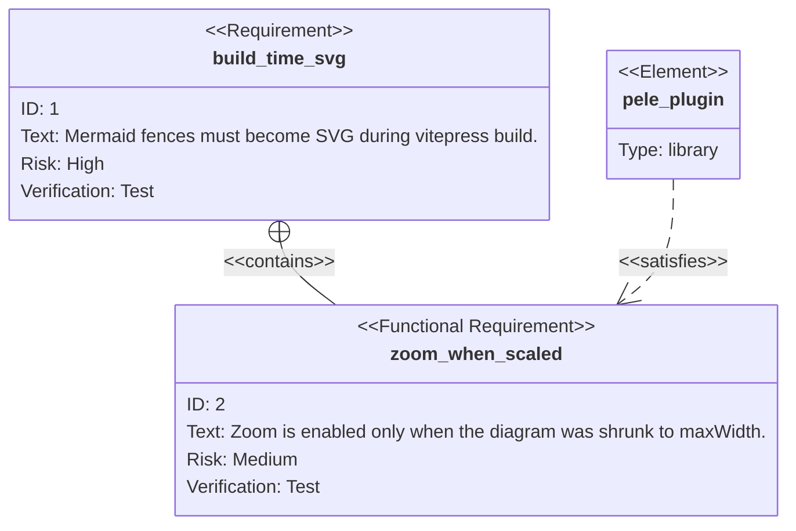
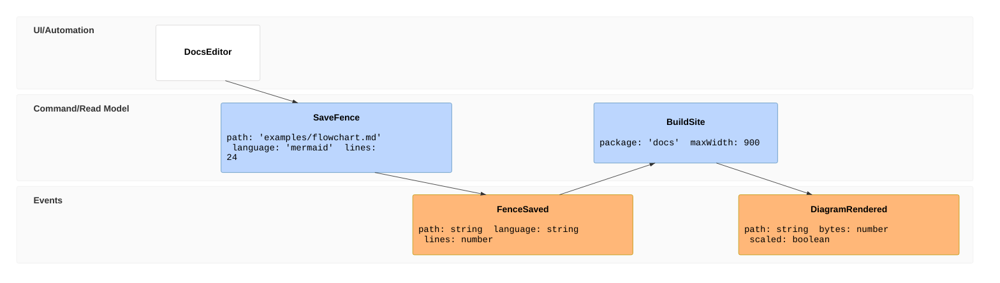

# Advanced

## Mermaid frontmatter

Pele honors Mermaid `---` config blocks in the fence:

```mermaid
---
config:
  flowchart:
    curve: step
---
flowchart TD
  A[Change plugin] --> B{Types OK?}
  B -->|Yes| C[Pack library]
  B -->|No| D[Adjust signature]
  D --> B
  C --> E([Docs rebuild])
```

## Git graph

```mermaid
gitGraph
  commit id: "init"
  branch docs
  branch release
  commit id: "examples"
  checkout main
  commit id: "pack-fix"
  checkout docs
  commit id: "sidebar"
  checkout main
  merge docs id: "merge-docs"
  commit id: "0.0.3"
  checkout release
  cherry-pick id: "merge-docs" parent: "sidebar"
  commit id: "tag"
  checkout docs
  commit id: "more-charts"
```

## Packet

```mermaid
---
title: "Docs request"
---
packet
0-15: "Method"
16-31: "Status"
32-63: "Cache key"
64-95: "Page path hash"
96-99: "Flags"
100-105: "Reserved"
106: "SSR"
107: "ZOOM"
108: "DARK"
109: "EDIT"
110: "SEARCH"
111: "DRAFT"
112-127: "Asset id"
128-143: "Checksum"
144-159: "Locale"
160-191: "(Headers)"
192-255: "Body (HTML + SVG)"
```

## Kanban

```mermaid
---
config:
  kanban:
    ticketBaseUrl: 'https://github.com/suveshmoza/vitepress-pele/issues/#TICKET#'
---
kanban
  Backlog
    [Structural MarkdownIt types]
    types[Document peer ranges]
  [In progress]
    id6[Curate advanced docs examples]
  Review
    id4[Check wide C4 layout]@{ ticket: 12, assigned: 'docs', priority: 'High' }
  Done
    id5[Monorepo apps/docs]
    id3[Pack-before-dev scripts]@{ ticket: 9, assigned: 'ci', priority: 'High' }
```

## Block

```mermaid
block
  columns 3
  install:3
  block:setup:2
    columns 2
    config theme options exports
  end
  examples
  block:ship:3
    pack test docs release npm readers
  end
```

## Requirement

```mermaid
---
config:
  theme: default
  look: classic
  layout: dagre
---
requirementDiagram
  requirement build_time_svg {
    id: 1
    text: Mermaid fences must become SVG during vitepress build.
    risk: high
    verifymethod: test
  }
  functionalRequirement zoom_when_scaled {
    id: 2
    text: Zoom is enabled only when the diagram was shrunk to maxWidth.
    risk: medium
    verifymethod: test
  }
  element pele_plugin {
    type: library
  }
  build_time_svg - contains -> zoom_when_scaled
  pele_plugin - satisfies -> zoom_when_scaled
```

## Event modeling

```mermaid
eventmodeling

timeframe 01 ui DocsEditor
timeframe 02 command SaveFence [[SaveFence01]]
timeframe 03 event FenceSaved [[FenceSaved]]
timeframe 04 command BuildSite [[BuildSite01]]
timeframe 05 event DiagramRendered [[DiagramRendered]]

data SaveFence01 {
  path: 'examples/flowchart.md'
  language: 'mermaid'
  lines: 24
}

data BuildSite01 {
  package: 'docs'
  maxWidth: 900
}

data FenceSaved {
  path: string
  language: string
  lines: number
}

data DiagramRendered {
  path: string
  bytes: number
  scaled: boolean
}
```
