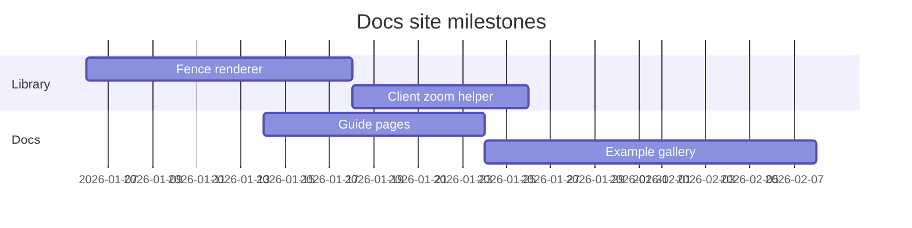
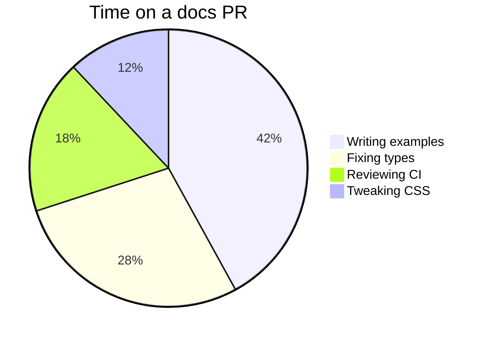
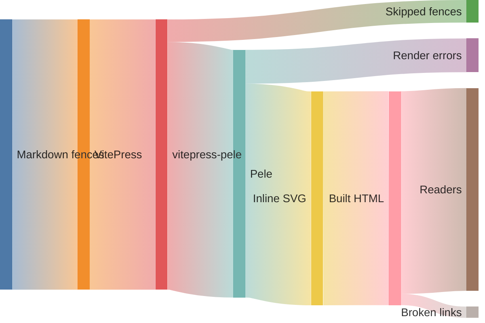
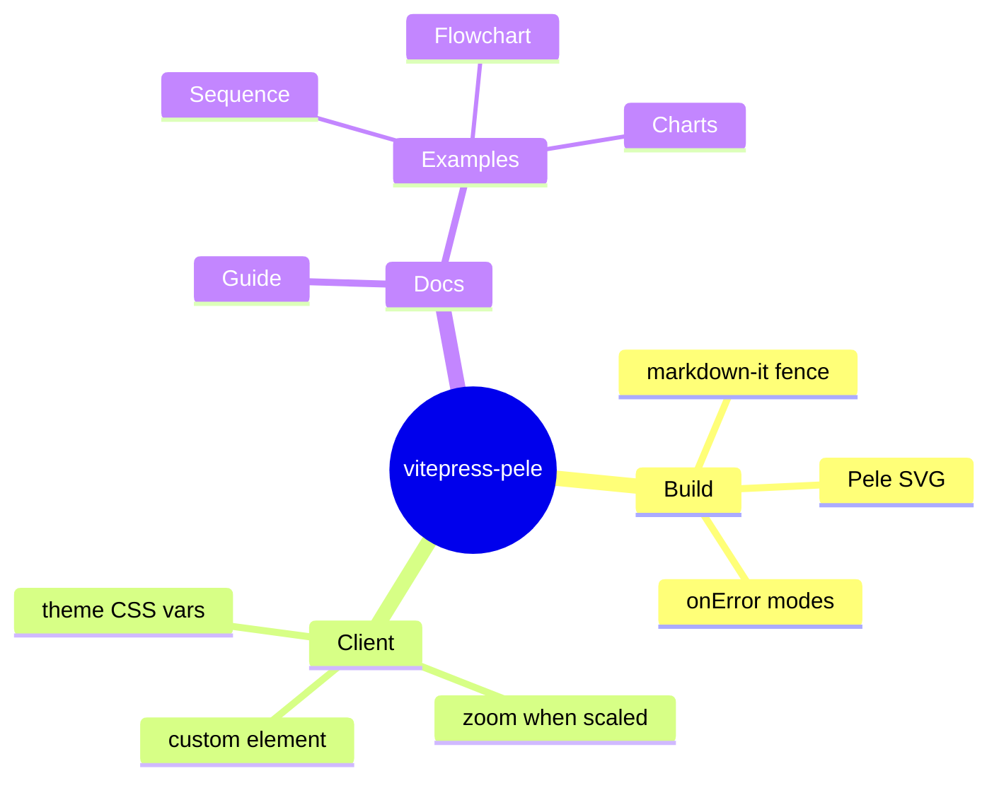
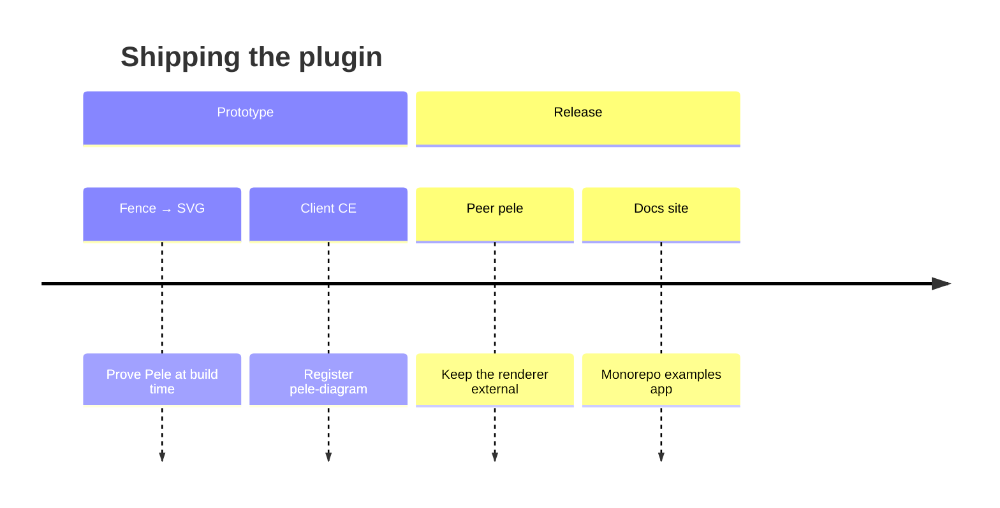
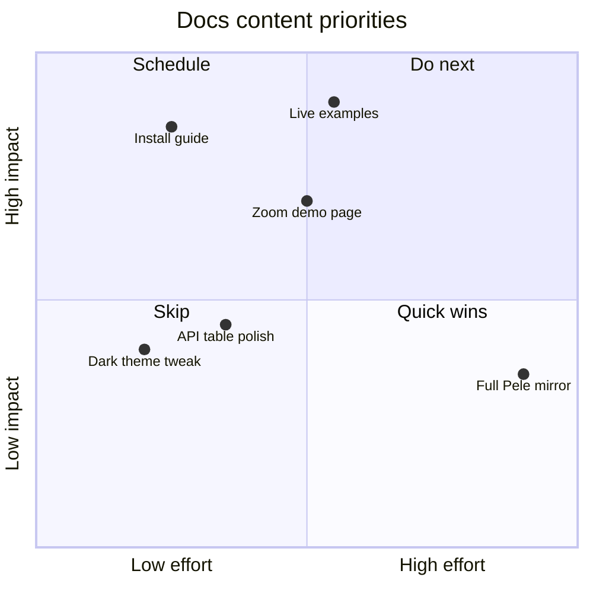

# Charts

## Gantt

```mermaid
gantt
  title Docs site milestones
  dateFormat YYYY-MM-DD
  section Library
    Fence renderer     :a1, 2026-01-06, 12d
    Client zoom helper :after a1, 8d
  section Docs
    Guide pages        :2026-01-14, 10d
    Example gallery    :15d
```

## Pie

```mermaid
pie title Time on a docs PR
  "Writing examples" : 42
  "Fixing types" : 28
  "Reviewing CI" : 18
  "Tweaking CSS" : 12
```

## Sankey

Frontmatter `config.sankey` is passed through Mermaid/Pele:

```mermaid
---
config:
  sankey:
    showValues: false
    nodeWidth: 15
    nodePadding: 20
---
sankey

Markdown fences,VitePress,120
VitePress,vitepress-pele,120
vitepress-pele,Pele,110
vitepress-pele,Skipped fences,10
Pele,Inline SVG,95
Pele,Render errors,15
Inline SVG,Built HTML,95
Built HTML,Readers,90
Built HTML,Broken links,5
```

## Mindmap

```mermaid
mindmap
  root((vitepress-pele))
    Build
      markdown-it fence
      Pele SVG
      onError modes
    Client
      custom element
      zoom when scaled
      theme CSS vars
    Docs
      Guide
      Examples
        Flowchart
        Sequence
        Charts
```

## Timeline

```mermaid
timeline
  title Shipping the plugin
  section Prototype
    Fence → SVG : Prove Pele at build time
    Client CE : Register pele-diagram
  section Release
    Peer pele : Keep the renderer external
    Docs site : Monorepo examples app
```

## Quadrant chart

```mermaid
quadrantChart
  title Docs content priorities
  x-axis Low effort --> High effort
  y-axis Low impact --> High impact
  quadrant-1 Do next
  quadrant-2 Schedule
  quadrant-3 Skip
  quadrant-4 Quick wins
  Install guide: [0.25, 0.85]
  Live examples: [0.55, 0.9]
  API table polish: [0.35, 0.45]
  Full Pele mirror: [0.9, 0.35]
  Dark theme tweak: [0.2, 0.4]
  Zoom demo page: [0.5, 0.7]
```
