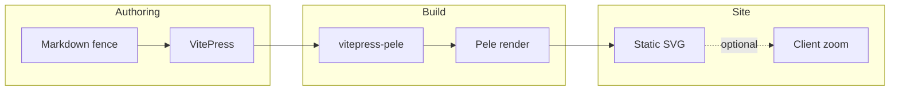
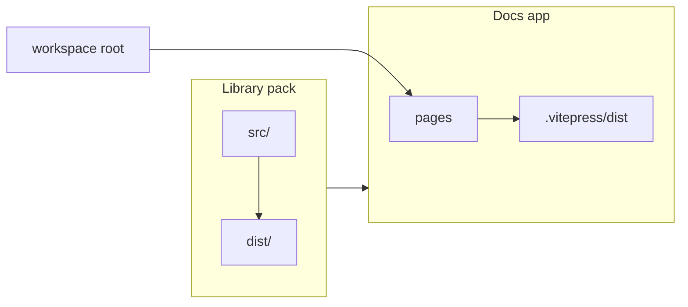
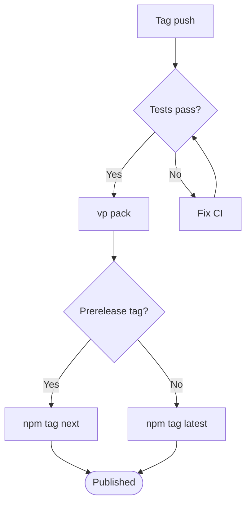
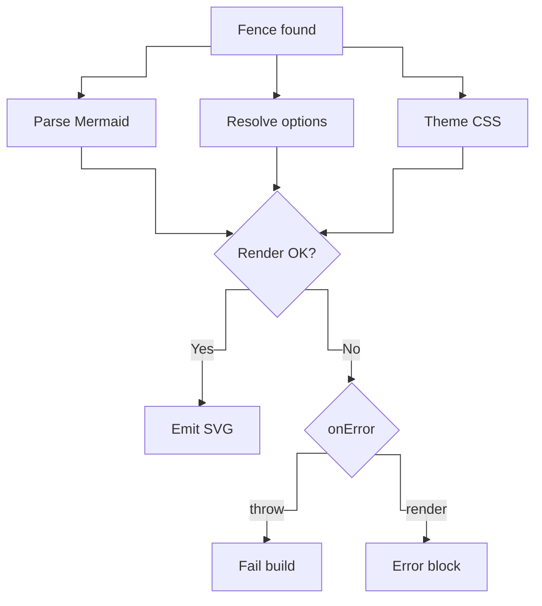
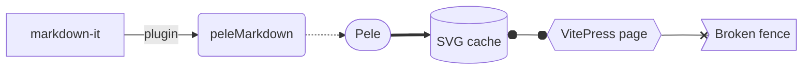

# Flowchart

## Plugin pipeline

```mermaid
---
config:
  theme: default
  look: classic
  layout: dagre
---
flowchart LR
  subgraph Authoring
    MD[Markdown fence]
    VP[VitePress]
  end
  subgraph Build
    Plugin[vitepress-pele]
    Pele[Pele render]
  end
  subgraph Site
    HTML[Static SVG]
    Zoom[Client zoom]
  end
  MD --> VP
  VP --> Plugin
  Plugin --> Pele
  Pele --> HTML
  HTML -. optional .-> Zoom
```

## Nested layout directions

```mermaid
flowchart LR
  subgraph pack[Library pack]
    direction TB
    src[src/] --> dist[dist/]
  end
  subgraph docs[Docs app]
    direction TB
    pages[pages] --> site[.vitepress/dist]
  end
  pack --> docs
  workspace[workspace root] ---> pages
```

## Publish decision

```mermaid
flowchart TD
  A[Tag push] --> B{Tests pass?}
  B -->|Yes| C[vp pack]
  B -->|No| D[Fix CI]
  D --> B
  C --> E{Prerelease tag?}
  E -->|Yes| F[npm tag next]
  E -->|No| G[npm tag latest]
  F --> H([Published])
  G --> H
```

## Step curves

```mermaid
---
config:
  flowchart:
    curve: step
---
flowchart TD
  A[Fence found] --> B[Parse Mermaid]
  A --> C[Resolve options]
  A --> D[Theme CSS]
  B --> E{Render OK?}
  C --> E
  D --> E
  E -->|Yes| F[Emit SVG]
  E -->|No| G{onError}
  G -->|throw| H[Fail build]
  G -->|render| I[Error block]
```

## Edge styles

```mermaid
flowchart LR
  A[markdown-it] -->|plugin| B(peleMarkdown)
  B -.-> C([Pele])
  C ==> D[(SVG cache)]
  D o--o E{{VitePress page}}
  E --x F>Broken fence]
```
