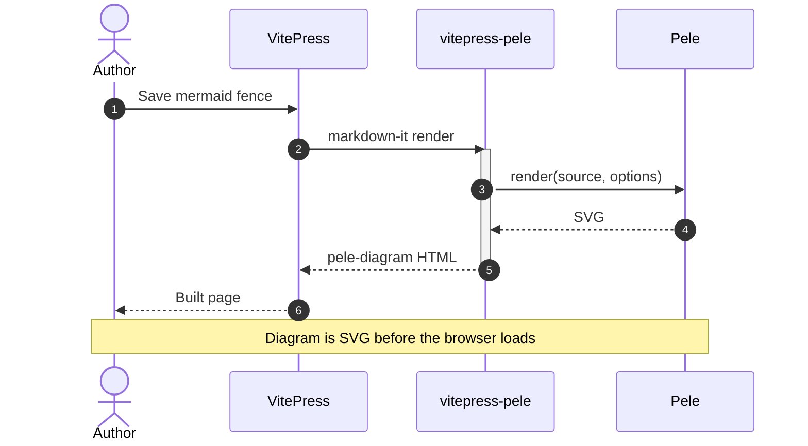
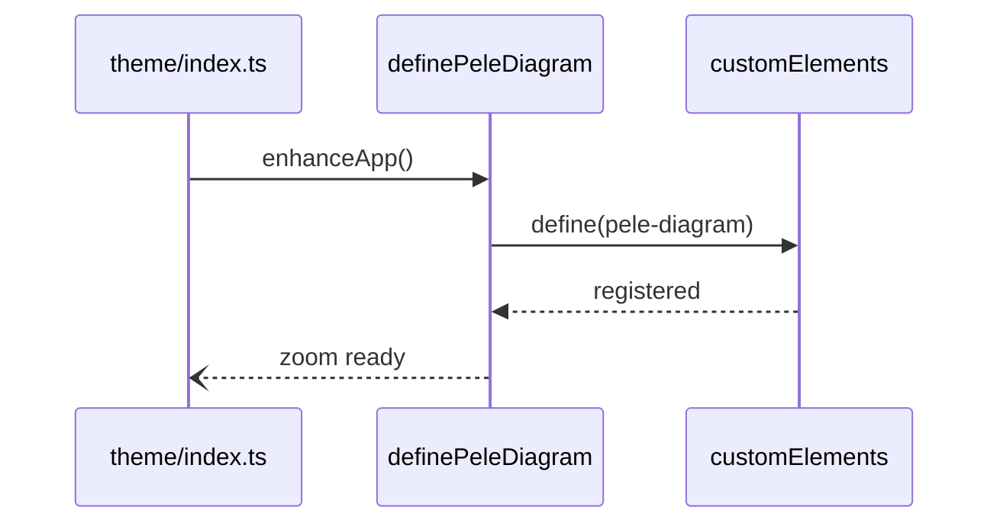
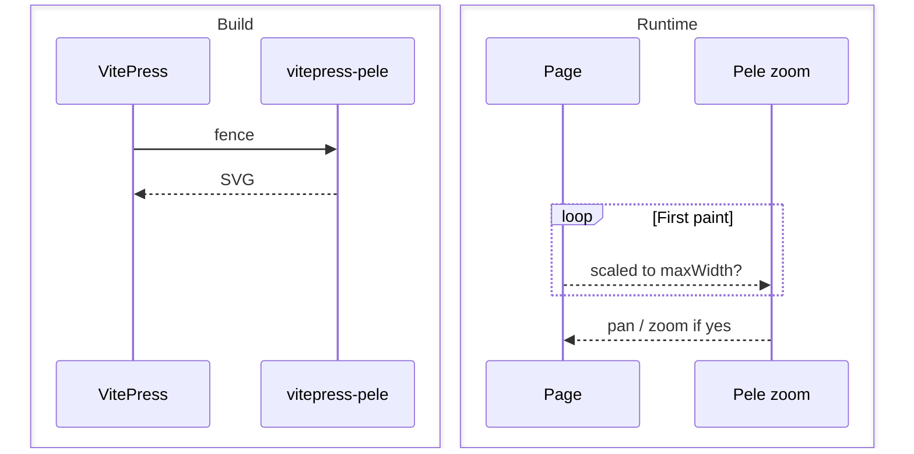

# Sequence

## Docs build

```mermaid
---
config:
  theme: default
  look: classic
---
sequenceDiagram
  autonumber
  actor Author
  participant VP as VitePress
  participant Plugin as vitepress-pele
  participant Pele
  Author->>VP: Save mermaid fence
  VP->>Plugin: markdown-it render
  activate Plugin
  Plugin->>Pele: render(source, options)
  Pele-->>Plugin: SVG
  Plugin-->>VP: pele-diagram HTML
  deactivate Plugin
  VP-->>Author: Built page
  Note over Author,Pele: Diagram is SVG before the browser loads
```

## Theme registration

```mermaid
sequenceDiagram
  participant Theme as theme/index.ts
  participant Client as definePeleDiagram
  participant DOM as customElements
  link Theme: Config @ https://vitepress.dev/guide/custom-theme
  link Client: Package @ https://www.npmjs.com/package/vitepress-pele
  Theme->>Client: enhanceApp()
  Client->>DOM: define(pele-diagram)
  DOM-->>Client: registered
  Client--)Theme: zoom ready
```

## Groups and retries

```mermaid
sequenceDiagram
  box Build
    participant VP as VitePress
    participant Plugin as vitepress-pele
  end
  box Runtime
    participant Page
    participant Zoom as Pele zoom
  end
  VP->>Plugin: fence
  Plugin-->>VP: SVG
  loop First paint
    Page-->>Zoom: scaled to maxWidth?
  end
  Zoom-->>Page: pan / zoom if yes
```
